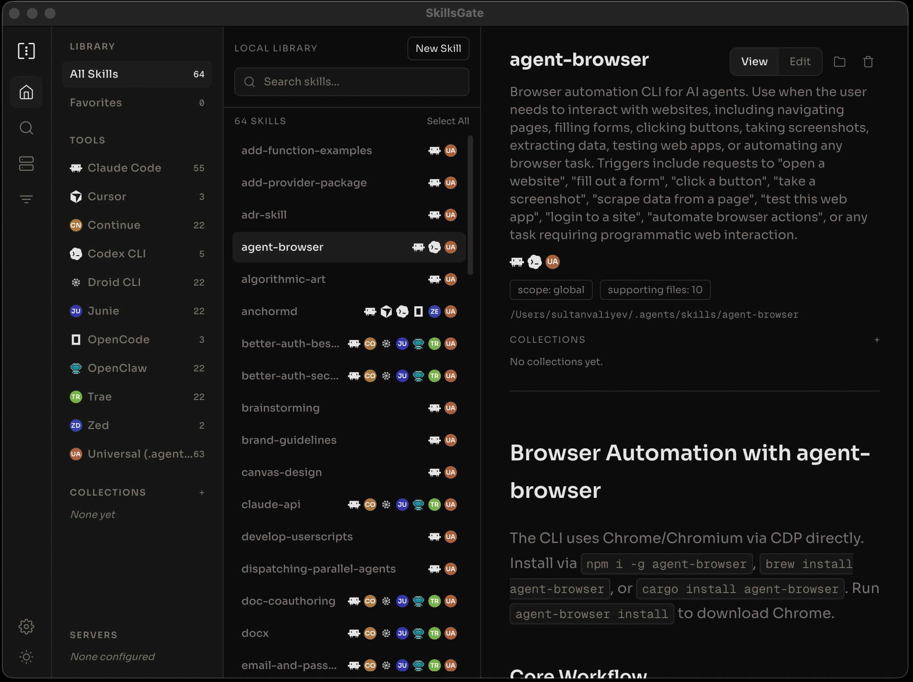

<p align="center">
  
</p>

<h1 align="center">SkillsGate</h1>

<p align="center">Desktop app and TUI to organize AI agent skills across 18 tools.</p>

<p align="center">
  <a href="https://skillsgate.ai">Website</a> &middot;
  <a href="https://x.com/sultanvaliyev">@sultanvaliyev</a>
</p>

<p align="center">
  <a href="https://github.com/skillsgate/skillsgate/releases/download/desktop-v0.1.6/SkillsGate-0.1.6-arm64.dmg">macOS (Apple Silicon)</a> &middot;
  <a href="https://github.com/skillsgate/skillsgate/releases/download/desktop-v0.1.6/SkillsGate-0.1.6.dmg">macOS (Intel)</a> &middot;
  <a href="https://github.com/skillsgate/skillsgate/releases/download/desktop-v0.1.6/SkillsGate.Setup.0.1.6.exe">Windows</a> &middot;
  <a href="https://github.com/skillsgate/skillsgate/releases/download/desktop-v0.1.6/SkillsGate-0.1.6-x86_64.AppImage">Linux</a> &middot;
  <a href="https://github.com/skillsgate/skillsgate/releases/download/desktop-v0.1.6/SkillsGate-0.1.6-amd64.deb">Ubuntu .deb</a> &middot;
  <code>npm i -g @skillsgate/tui</code>
</p>

<p align="center">
  
  
  
</p>

<p align="center">
  
</p>

---

Discover, install, and publish skills for Claude Code, Cursor, Windsurf, GitHub Copilot, and 14 other AI coding agents -- all from one place. Think of it as **npm for AI skills**.

## Download

### Desktop App (macOS, Windows, Linux)

[macOS (Apple Silicon)](https://github.com/skillsgate/skillsgate/releases/download/desktop-v0.1.6/SkillsGate-0.1.6-arm64.dmg) &middot; [macOS (Intel)](https://github.com/skillsgate/skillsgate/releases/download/desktop-v0.1.6/SkillsGate-0.1.6.dmg) &middot; [Windows](https://github.com/skillsgate/skillsgate/releases/download/desktop-v0.1.6/SkillsGate.Setup.0.1.6.exe) &middot; [Linux AppImage](https://github.com/skillsgate/skillsgate/releases/download/desktop-v0.1.6/SkillsGate-0.1.6-x86_64.AppImage) &middot; [Debian/Ubuntu .deb](https://github.com/skillsgate/skillsgate/releases/download/desktop-v0.1.6/SkillsGate-0.1.6-amd64.deb)

Three-column skill browser with search, favorites, remote servers, and a built-in editor. Auto-updates via GitHub Releases. The macOS build is signed and notarized with Apple.

### CLI

```bash
npm install -g skillsgate
```

### TUI (Terminal UI)

```bash
npm install -g @skillsgate/tui
```

Or run directly: `npx @skillsgate/tui`

<p align="center">
  
</p>

---

## Why SkillsGate?

AI coding skills are scattered across hundreds of GitHub repos. You can't find what exists, creators get no visibility, and every team builds the same workflows from scratch.

SkillsGate fixes this. One search, one install command, every agent.

---

## Managing Skills

SkillsGate gives you three ways to manage your AI agent skills, depending on how you prefer to work.

### Desktop App

The desktop app provides a visual, Finder-style experience:

- **Browse installed skills** in a three-column layout with agent filtering on the left, skill list in the middle, and rendered SKILL.md content on the right
- **View and edit** -- toggle between the rendered view and a raw editor to modify SKILL.md content directly. Changes are saved to disk instantly
- **Per-agent management** -- remove a skill from a specific agent (e.g., uninstall from Cursor but keep in Claude Code) or remove from all agents at once
- **Open in Finder** -- click the folder icon to jump to the skill's directory on disk
- **Discover and install** -- browse the catalog of 80,000+ skills, search with keywords or AI-powered semantic search, and install with one click
- **Favorites** -- star skills from the catalog for quick access later
- **Remote servers** -- connect to other machines via SSH to browse and sync skills
- **Settings sync** -- preferences are shared with the TUI via a local SQLite database

### Terminal UI (TUI)

For keyboard-driven workflows:

- **Three-panel layout** -- agent filter sidebar, skill list, and inline detail panel
- **Navigate with keyboard** -- `j/k` to move, `v` to view detail, `e` to see raw source, `o` to open folder
- **Per-agent delete** -- press `d` on a multi-agent skill and choose which agent to remove from
- **Discover tab** -- search the catalog, toggle between keyword (`[Keyword]`) and AI search (`[AI Search]`) with `m`
- **Favorites tab** -- view and manage your starred skills
- **Servers tab** -- add SSH servers, sync remote skills, browse cached results
- **Settings** -- press `s` to configure install scope, method, theme, and more

### CLI

For scripting and automation:

```bash
# Install from multiple sources
skillsgate add @username/my-skill               # from SkillsGate registry
skillsgate add vercel-labs/agent-skills          # from GitHub
skillsgate add owner/repo@specific-skill         # specific skill in a repo
skillsgate add ./my-local-skills                 # from a local path

# Manage installed skills
skillsgate list                                  # show all installed skills
skillsgate list -g                               # show global skills
skillsgate remove my-skill                       # remove a skill
skillsgate update                                # update all skills
skillsgate sync                                  # sync skills from node_modules

# Search and discover
skillsgate search "tailwind responsive"          # AI-powered semantic search
skillsgate scan @username/some-skill             # security scan before installing

# Publish your own
skillsgate publish --init                        # create a SKILL.md template
skillsgate publish ./my-skill                    # publish to SkillsGate

# Launch the TUI from the CLI
skillsgate tui
```

---

## Features

- **Search with natural language** -- AI-powered semantic search across 80,000+ skills, plus keyword search for everyone
- **One install, every agent** -- skills installed to all your detected agents simultaneously via symlinks
- **18 agents supported** -- Claude Code, Cursor, Windsurf, GitHub Copilot, Codex CLI, Cline, Continue, Amp, Goose, Junie, Kilo Code, OpenCode, OpenClaw, Pear AI, Roo Code, Trae, Zed, and Universal
- **Desktop app** -- three-column Finder-style browser with built-in skill editor and per-agent management
- **Terminal UI** -- full-featured TUI with keyboard-driven navigation and inline detail preview
- **Remote servers** -- connect via SSH to browse and sync skills from other machines
- **Security scanning** -- scan skills for prompt injection and malicious code before installing
- **Publish your own** -- share skills publicly or keep them private for your team
- **Settings sync** -- shared SQLite database keeps desktop and TUI settings in sync
- **Auth sync** -- sign in once and both desktop and TUI share the session

---

## CLI Reference

| Command | Description |
|---------|-------------|
| `skillsgate add <source>` | Install from SkillsGate, GitHub, or local path |
| `skillsgate search <query>` | AI-powered semantic search |
| `skillsgate scan <source>` | Security scan before installing |
| `skillsgate publish [path]` | Publish a skill to SkillsGate |
| `skillsgate remove [name]` | Remove installed skills |
| `skillsgate list` | Show installed skills |
| `skillsgate update [name]` | Check and apply updates |
| `skillsgate sync` | Sync skills from node_modules |
| `skillsgate tui` | Launch terminal UI |
| `skillsgate login` | Sign in via browser |
| `skillsgate logout` | Sign out |
| `skillsgate whoami` | Show current user |

---

## TUI Keyboard Shortcuts

| Key | Action |
|-----|--------|
| `1/2/3/4` | Switch tabs (Installed / Discover / Favorites / Servers) |
| `j/k` | Navigate list |
| `/` | Focus search input |
| `Tab` | Cycle focus between panes |
| `v` | View skill detail |
| `e` | Toggle rendered / raw source view |
| `i` | Install skill |
| `d` | Remove skill (per-agent selection for multi-agent skills) |
| `o` | Open folder (local) or URL (catalog) |
| `m` | Toggle keyword / AI search mode |
| `l` | Login / re-login |
| `s` | Settings |
| `?` | Help overlay |
| `Ctrl+Q` | Quit |

---

## Architecture

```
apps/
  api/          Hono API on Cloudflare Workers (api.skillsgate.ai)
  web/          React Router v7 on Workers (skillsgate.ai)
  desktop/      Electron desktop app

packages/
  cli/          CLI published as `skillsgate` on npm
  tui/          Terminal UI published as `@skillsgate/tui`
  ui/           Shared React components
  local-db/     Shared SQLite persistence + SSH client
  database/     Prisma schema + migrations (PlanetScale Postgres)
```

## Development

```bash
# Install dependencies
npm install

# Run the web app
npm run dev -w skillsgate-web

# Run the desktop app
cd apps/desktop && npx electron-vite dev

# Run the TUI
cd packages/tui && bun run src/index.tsx

# Deploy web + API
npm run deploy
```

Requires Node.js 18+, Bun (for TUI), a Cloudflare account, and PlanetScale database.

---

## Contributing

SkillsGate is open source. Contributions welcome.

1. Fork the repo
2. Create a feature branch
3. Make your changes
4. Open a pull request

## License

MIT

---

<p align="center">
  Built by <a href="https://x.com/sultanvaliyev">Sultan Valiyev</a>
</p>
